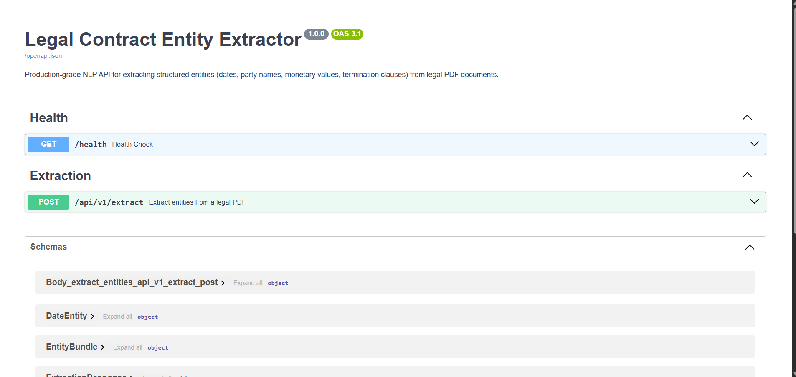
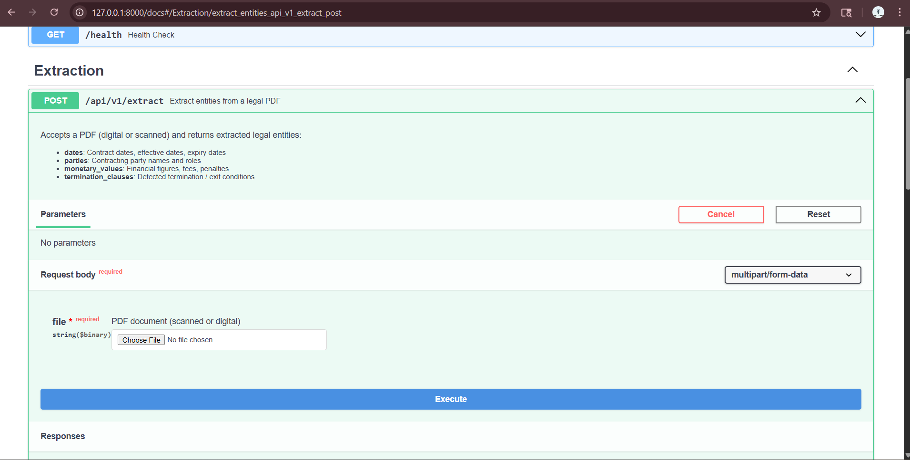
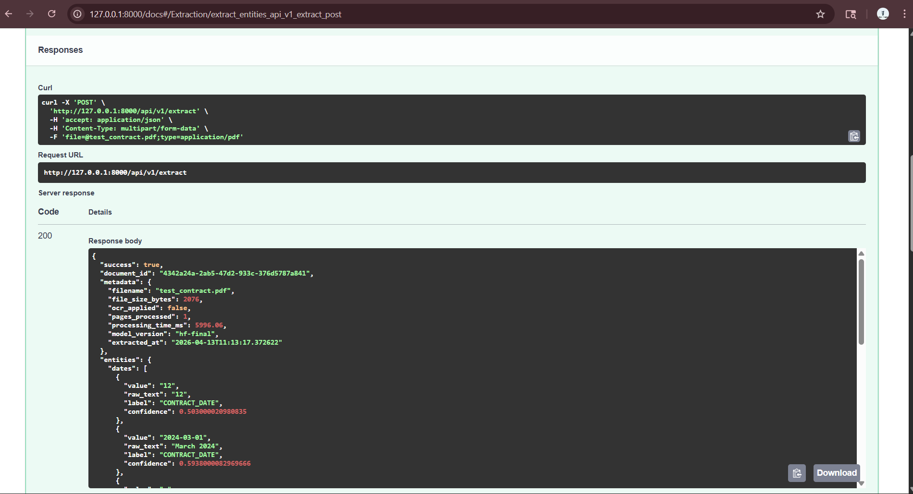

# ⚖️ Intelligent Document Processing System
## Legal Contract Entity Extractor

> A production-grade AI pipeline that automatically extracts structured entities from legal PDF contracts — handling both digital and scanned documents using OCR, BERT-based NER, and rule-based validation.

[](https://www.python.org/downloads/)
[](https://fastapi.tiangolo.com)
[](https://huggingface.co/nlpaueb/legal-bert-base-uncased)
[](https://www.docker.com/)
[](https://mlflow.org/)
[](LICENSE)

---

## 📋 Table of Contents

- [Overview](#-overview)
- [Architecture](#-architecture)
- [Tech Stack](#-tech-stack)
- [Folder Structure](#-folder-structure)
- [Pipeline Design](#-pipeline-design)
- [Extracted Entities](#-extracted-entities)
- [Setup — Local](#-setup--local-development)
- [Setup — Docker](#-setup--docker)
- [API Reference](#-api-reference)
- [Sample Output](#-sample-json-output)
- [Model Training](#-model-training)
- [Running Tests](#-running-tests)
- [MLflow Tracking](#-mlflow-experiment-tracking)
- [Roadmap](#-roadmap)

---

## 🎯 Overview

Organizations such as law firms and financial institutions process thousands of legal contracts annually. Manual review is slow, error-prone, and expensive. This system eliminates that bottleneck by building an end-to-end automated pipeline that:

- Accepts **any PDF** — digitally generated or scanned
- Automatically applies **OCR** when text cannot be extracted directly
- Runs **BERT-based Named Entity Recognition** fine-tuned on 509 real CUAD legal contracts
- Returns **structured JSON** ready for downstream contract management systems

| Entity | Examples |
|---|---|
| **Dates** | Effective date, expiry date, signing date — normalized to ISO-8601 |
| **Party Names** | Organizations and individuals — with role inference |
| **Monetary Values** | Fees, penalties, payments — with parsed amount and currency |
| **Termination Clauses** | Full clause text, type classification, notice period |

---

## 🏗️ Architecture

```
┌──────────────────────────────────────────────────────────────────┐
│                    CLIENT (Browser / curl / SDK)                  │
└─────────────────────────────┬────────────────────────────────────┘
                              │  POST /api/v1/extract
                              ▼
┌──────────────────────────────────────────────────────────────────┐
│                      FastAPI Application                          │
│  ┌─────────────────────────────────────────────────────────────┐ │
│  │                   ExtractionService                          │ │
│  │              (Pipeline Orchestrator)                         │ │
│  └──────┬──────────────┬──────────────┬────────────────────────┘ │
└─────────┼──────────────┼──────────────┼──────────────────────────┘
          │              │              │
          ▼              ▼              ▼
   ┌──────────┐   ┌───────────┐   ┌──────────────────────────────┐
   │ PDFUtils │   │TextCleaner│   │         NERService            │
   │          │   │           │   │      (Singleton)              │
   │pdfplumber│   │• Ligatures│   │                               │
   │(digital) │   │• OCR noise│   │  1. legal-bert-base-uncased  │
   │          │   │• Hyphens  │   │     (fine-tuned on CUAD)     │
   │    ↓     │   │• Unicode  │   │         ↓ fallback           │
   │(scanned) │   └───────────┘   │  2. spaCy en_core_web_lg     │
   │          │                   │         ↓ fallback           │
   │OCRPipeline│                  │  3. Rule-based regex         │
   │pdf2image +│                  │  + Rule supplement always    │
   │Tesseract  │                  └──────────────┬───────────────┘
   └──────────┘                                  │
                                                 ▼
                                    ┌────────────────────────┐
                                    │      PostProcessor      │
                                    │                         │
                                    │ Dates  → ISO-8601       │
                                    │ Money  → amount+currency│
                                    │ Parties→ name+role      │
                                    │ Terms  → type+notice    │
                                    └────────────┬────────────┘
                                                 │
                                                 ▼
                                    ┌────────────────────────┐
                                    │    Structured JSON      │
                                    └────────────────────────┘
```

---

## 🛠️ Tech Stack

| Component | Technology |
|---|---|
| API Framework | FastAPI 0.111 + Uvicorn |
| NER Model | `nlpaueb/legal-bert-base-uncased` fine-tuned on CUAD |
| NER Fallback 1 | spaCy `en_core_web_lg` |
| NER Fallback 2 | Rule-based regex engine |
| PDF Extraction | pdfplumber |
| OCR | Tesseract + pdf2image + OpenCV |
| Training Data | CUAD (509 contracts) + 100 synthetic contracts |
| Experiment Tracking | MLflow |
| Containerisation | Docker + Docker Compose |
| Validation | Pydantic v2 |
| Package Manager | Poetry |
| Testing | pytest + httpx |
| Logging | python-json-logger (structured JSON logs) |

---

## 📁 Folder Structure

```
legal-contract-extractor/
│
├── app/                          # FastAPI application
│   ├── main.py                   # Entrypoint, middleware, root redirect
│   ├── routes/
│   │   ├── extraction.py         # POST /api/v1/extract
│   │   └── health.py             # GET /health
│   ├── services/
│   │   ├── extraction_service.py # Pipeline orchestrator
│   │   ├── ner_service.py        # 3-tier NER (BERT → spaCy → rules)
│   │   ├── text_cleaner.py       # OCR noise removal
│   │   └── postprocessor.py      # Validation + normalisation
│   ├── schemas/
│   │   └── extraction.py         # Pydantic request/response models
│   └── utils/
│       ├── logger.py             # Structured logging
│       └── pdf_utils.py          # Smart PDF extraction with OCR fallback
│
├── ocr/
│   └── ocr_pipeline.py           # Tesseract OCR + OpenCV preprocessing
│
├── training/
│   ├── train.py                  # Fine-tune BERT with GPU support
│   └── evaluate.py               # Evaluate on held-out test set
│
├── config/
│   ├── config.yaml               # Non-secret settings
│   └── settings.py               # Pydantic-settings env var loading
│
├── data/
│   ├── raw/                      # Input PDFs (gitignored)
│   ├── processed/                # Cleaned text (gitignored)
│   └── annotations/
│       └── sample_annotations.jsonl  # Sample Doccano JSONL format
│
├── tests/
│   ├── test_pipeline.py          # Unit tests for TextCleaner, PostProcessor
│   └── test_api.py               # FastAPI integration tests
│
├── models/                       # Trained model artifacts (gitignored)
├── cuad_to_jsonl.py              # Convert CUAD dataset to NER training format
├── generate_contracts.py         # Generate synthetic training contracts
├── split_data.py                 # Split annotations into train/val/test
├── annotate.py                   # CLI annotation tool (no Doccano needed)
├── run.py                        # Simplified startup script
├── Dockerfile                    # Multi-stage production image
├── docker-compose.yml            # API + MLflow services
├── pyproject.toml                # Poetry dependency management
├── .env.example                  # Environment variable template
└── README.md
```

---

## 🔄 Pipeline Design

```
PDF Input
    │
    ├─► pdfplumber ──► Text sufficient? ──YES──► Raw Text
    │                         │
    │                         NO
    │                         ▼
    │              pdf2image → PIL Image
    │              OpenCV preprocessing
    │              (deskew, denoise, binarise)
    │              Tesseract OCR
    │                         │
    │                         └──────────────► Raw Text
    │
    ▼
TextCleaner
(ligatures, OCR artefacts, broken hyphens, unicode normalisation)
    │
    ▼
NERService
    ├── legal-bert-base-uncased (fine-tuned on 509 CUAD contracts)
    ├── spaCy fallback (if model not loaded)
    ├── Rule-based fallback (if spaCy not installed)
    └── Rule-based supplement (always runs, fills BERT gaps)
    │
    ▼
PostProcessor
    ├── Dates    → ISO-8601 normalisation, label classification
    ├── Parties  → name cleaning, role inference
    ├── Money    → amount parsing, currency detection
    └── Terms    → clause type classification, notice period extraction
    │
    ▼
Structured JSON Response
```

---

## 📦 Extracted Entities

### Dates
- Normalised to **ISO-8601** (`YYYY-MM-DD`)
- Labels: `EFFECTIVE_DATE`, `EXPIRY_DATE`, `TERMINATION_DATE`, `SIGNING_DATE`, `CONTRACT_DATE`
- Duration patterns (`"30-day"`) automatically filtered out

### Parties
- Cleaned organisation/person names
- Roles inferred: `VENDOR`, `CLIENT`, `EMPLOYER`, `EMPLOYEE`, `CONTRACTOR`, `LESSOR`, `LESSEE`
- Handles `"hereinafter referred to as"` pattern

### Monetary Values
- Parsed `amount` (float) + `currency` (ISO 4217)
- Supports `$`, `€`, `£`, `₹` and codes `USD`, `EUR`, `GBP`, `INR`
- Handles multipliers: million, billion, thousand
- Context snippet attached for auditability
- Noise filtering — clause numbers and bare integers excluded

### Termination Clauses
- Full clause text preserved
- Classified: `TERMINATION_FOR_CAUSE`, `TERMINATION_FOR_CONVENIENCE`, `TERMINATION_BY_MUTUAL_AGREEMENT`, `AUTOMATIC_TERMINATION`, `INSOLVENCY_TERMINATION`
- Notice period extracted (e.g., `"30 days"`)

## 📸 Screenshots

### API Documentation


### Extract Endpoint


### Live API Response

---

## 💻 Setup — Local Development

### Prerequisites

- Python 3.11+
- Poetry: `pip install poetry`
- Tesseract OCR:
  - Windows: [UB Mannheim installer](https://github.com/UB-Mannheim/tesseract/wiki)
  - macOS: `brew install tesseract`
  - Ubuntu: `sudo apt-get install tesseract-ocr tesseract-ocr-eng`
- Poppler:
  - Windows: [oschwartz10612/poppler-windows](https://github.com/oschwartz10612/poppler-windows/releases)
  - macOS: `brew install poppler`
  - Ubuntu: `sudo apt-get install poppler-utils`

### Steps

```bash
# 1. Clone the repository
git clone https://github.com/your-username/legal-contract-extractor.git
cd legal-contract-extractor

# 2. Install dependencies
poetry install

# 3. Download spaCy model
poetry run python -m spacy download en_core_web_lg

# 4. Configure environment
cp .env.example .env
# Edit .env — set TESSERACT_CMD path for Windows

# 5. Start the API
poetry run python run.py
```

The browser opens automatically at `http://127.0.0.1:8000/docs`.

---

## 🐳 Setup — Docker

```bash
# 1. Configure environment
cp .env.example .env

# 2. Build and start
docker-compose up --build

# API:    http://localhost:8000/docs
# MLflow: http://localhost:5000
```

---

## 📡 API Reference

### `GET /health`

```bash
curl http://localhost:8000/health
```

```json
{
  "status": "healthy",
  "service": "legal-contract-extractor",
  "version": "1.0.0"
}
```

---

### `POST /api/v1/extract`

Upload a PDF and receive extracted entities.

```bash
curl -X POST http://localhost:8000/api/v1/extract \
  -F "file=@contract.pdf"
```

**Python:**
```python
import httpx

with open("contract.pdf", "rb") as f:
    response = httpx.post(
        "http://localhost:8000/api/v1/extract",
        files={"file": ("contract.pdf", f, "application/pdf")},
    )
print(response.json())
```

**Limits:**
- Accepts: `application/pdf`
- Max file size: 50 MB
- Digital and scanned PDFs supported

---

## 📄 Sample JSON Output

```json
{
  "success": true,
  "document_id": "5198ed88-700b-48fa-b196-30e910360346",
  "metadata": {
    "filename": "service_agreement.pdf",
    "file_size_bytes": 2076,
    "ocr_applied": false,
    "pages_processed": 1,
    "processing_time_ms": 2209.08,
    "model_version": "hf-final",
    "extracted_at": "2026-04-08T10:28:16.628207"
  },
  "entities": {
    "dates": [
      {
        "value": "2024-03-12",
        "raw_text": "12 March 2024",
        "label": "CONTRACT_DATE",
        "confidence": 0.70
      },
      {
        "value": "2024-04-01",
        "raw_text": "01 April 2024",
        "label": "CONTRACT_DATE",
        "confidence": 0.75
      },
      {
        "value": "2025-03-31",
        "raw_text": "31 March 2025",
        "label": "CONTRACT_DATE",
        "confidence": 0.75
      }
    ],
    "parties": [
      {
        "name": "Alpha Tech Solutions Pvt Ltd.",
        "role": null,
        "raw_text": "Alpha Tech Solutions Pvt Ltd",
        "confidence": 0.87
      },
      {
        "name": "Beta Innovations LLP.",
        "role": null,
        "raw_text": "Beta Innovations LLP",
        "confidence": 0.79
      }
    ],
    "monetary_values": [
      {
        "amount": 25000.0,
        "currency": "USD",
        "raw_text": "$25,000",
        "context": "The total contract value is $25,000 payable in two installments.",
        "confidence": 0.80
      }
    ],
    "termination_clauses": [
      {
        "text": "Either party may terminate this agreement with a 30-day written notice.",
        "clause_type": "TERMINATION_FOR_CONVENIENCE",
        "notice_period": "30 days",
        "confidence": 0.80
      }
    ]
  }
}
```

---

## 🧠 Model Training

### Dataset

This project uses the **CUAD (Contract Understanding Atticus Dataset)** — 510 real commercial legal contracts with 13,000+ expert annotations, licensed under CC BY 4.0.

Download: [atticusprojectai.org/cuad](https://www.atticusprojectai.org/cuad)

### Training Pipeline

```bash
# Step 1 — Convert CUAD to NER format
poetry run python cuad_to_jsonl.py --input CUADv1.json --output data/annotations

# Step 2 — Generate synthetic short contracts (optional, improves short-doc performance)
poetry run python generate_contracts.py

# Step 3 — Split into train/val/test
poetry run python split_data.py

# Step 4 — Fine-tune BERT (GPU auto-detected)
poetry run python training/train.py \
  --data_dir data/annotations \
  --output_dir models/legal-ner-bert-v1 \
  --base_model nlpaueb/legal-bert-base-uncased \
  --epochs 5 \
  --batch_size 8

# Step 5 — Evaluate
poetry run python training/evaluate.py \
  --model_path models/legal-ner-bert-v1/final \
  --test_file data/annotations/test.jsonl
```

### Point API to trained model

```env
MODEL_PATH=models/legal-ner-bert-v1/final
```

### Annotation Tool (no Doccano needed)

```bash
poetry run python annotate.py
```

Interactive CLI — load a PDF, type entity text, press 1/2/3/4 to label. Saves directly to `data/annotations/train.jsonl`.

---

## 🧪 Running Tests

```bash
# All tests
poetry run pytest

# Unit tests only
poetry run pytest tests/test_pipeline.py -v

# API integration tests
poetry run pytest tests/test_api.py -v

# With coverage
poetry run pytest --cov=app --cov-report=html
```

---

## 📊 MLflow Experiment Tracking

Start MLflow UI:
```bash
poetry run mlflow ui --port 5000
```

Open `http://localhost:5000` to view:
- Training runs and hyperparameters
- Precision, Recall, F1 per epoch
- Model artifacts
- Run comparisons

When using Docker, MLflow is included in `docker-compose.yml` and runs at `http://localhost:5000` automatically.

---

## ⚙️ Environment Variables

Copy `.env.example` to `.env` and configure:

```env
APP_ENV=development
LOG_LEVEL=INFO
LOG_FORMAT=text

# NER Model — leave empty to use spaCy fallback
MODEL_PATH=models/legal-ner-bert-v1/final

# spaCy fallback model
SPACY_MODEL=en_core_web_lg

# Tesseract — required for scanned PDFs
TESSERACT_CMD=C:\Program Files\Tesseract-OCR\tesseract.exe

# MLflow (optional)
MLFLOW_TRACKING_URI=http://localhost:5000
```

---

## 🗺️ Roadmap

- [ ] Fine-tune on additional annotated short contracts
- [ ] Role detection using dependency parsing
- [ ] Multi-language contract support
- [ ] Async batch processing for large document sets
- [ ] Redis caching for repeated documents
- [ ] Prometheus metrics endpoint
- [ ] Kubernetes Helm chart
- [ ] Frontend dashboard

---

## 📄 License

MIT License — see [LICENSE](LICENSE) for details.

---

## 🤝 Contributing

1. Fork the repository
2. Create your feature branch: `git checkout -b feature/my-feature`
3. Commit: `git commit -m 'feat: add my feature'`
4. Push: `git push origin feature/my-feature`
5. Open a Pull Request

---

## 🙏 Acknowledgements

- [CUAD Dataset](https://www.atticusprojectai.org/cuad) — The Atticus Project (CC BY 4.0)
- [nlpaueb/legal-bert-base-uncased](https://huggingface.co/nlpaueb/legal-bert-base-uncased) — NLP Group, Athens University
- [dslim/bert-base-NER](https://huggingface.co/dslim/bert-base-NER) — Dan Abramson